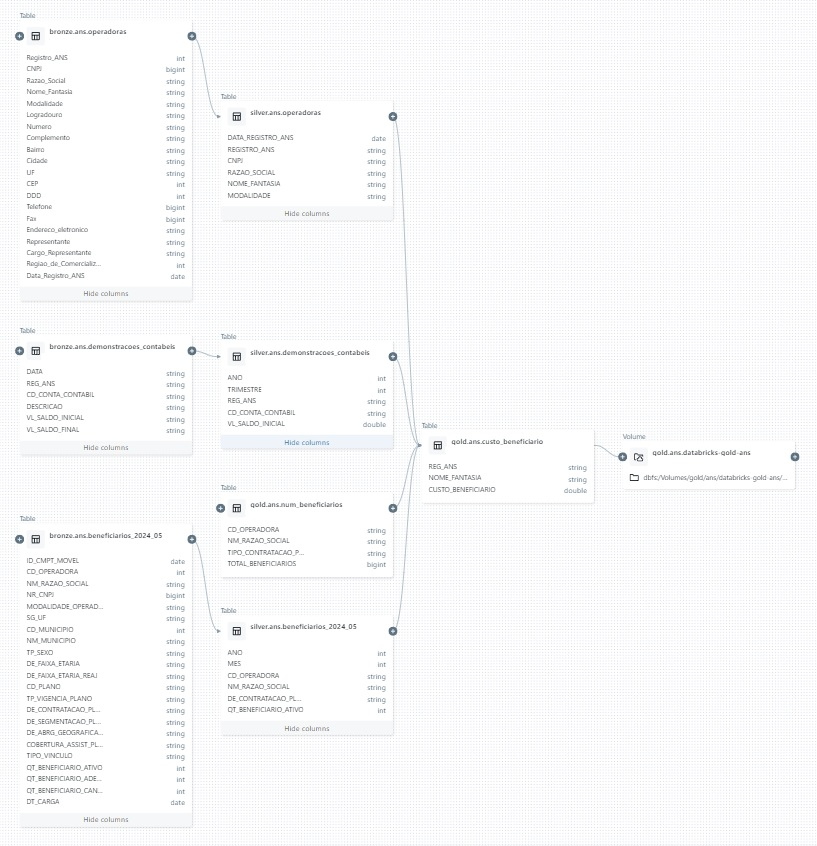
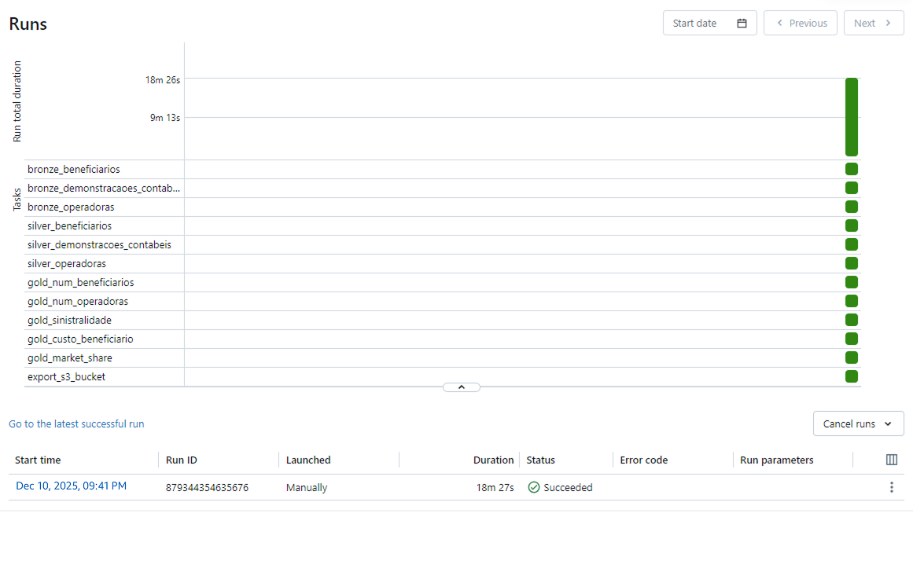
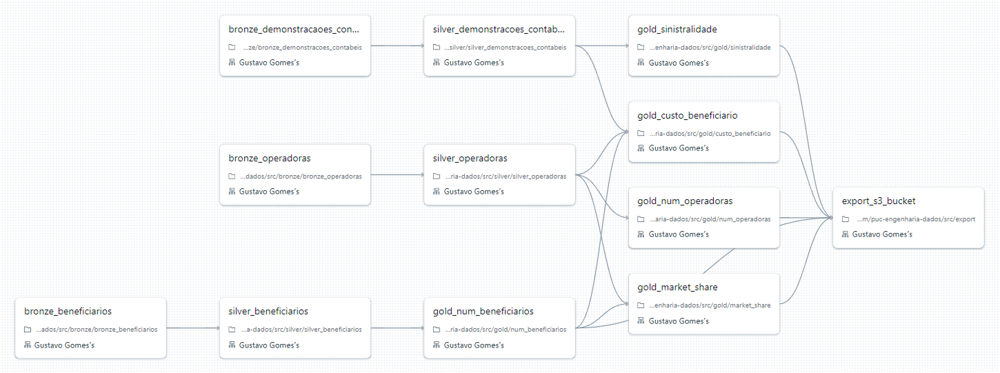
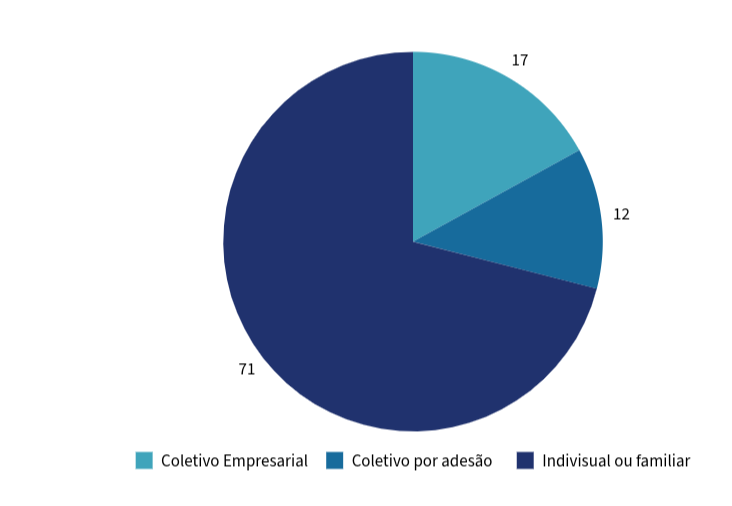

# MVP –  Projeto de Engenharia de dados (Pipeline de Dados em Nuvem com Databricks)

## Descrição

Este trabalho tem como objetivo o desenvolvimento de um **MVP de pipeline de dados em nuvem**, contemplando todas as etapas do ciclo analítico: **busca, coleta, modelagem, carga e análise de dados**.

A solução foi implementada utilizando a **Plataforma Databricks**, explorando conceitos de **Data Lakehouse**, **Delta Lake**, **pipelines de ETL**, **modelagem analítica** e **consultas SQL**, com foco em dados reais e públicos.


---

## Objetivo

O objetivo deste MVP é construir um pipeline de dados **escalável e governado** para analisar informações públicas da **Agência Nacional de Saúde Suplementar (ANS)**, permitindo responder perguntas relacionadas a **custos assistenciais, beneficiários e operadoras de planos de saúde no Brasil**.

As perguntas/problemas que desejo responder através das análises são:

1.Qual é o índice atual de sinistralidade no setor de seguros de saúde? Ele está abaixo ou acima da média histórica?

2.Qual é a segurança mais eficiente do ponto de vista de custo do beneficiário ?

3.Qual é a participação de mercado em número de beneficiários no segmento médico-hospitalar?

4.Quantas empresas de plano de saúde existem no Brasil?

5.Quantos beneficiários existem no Brasil? Qual é a taxa de cobertura?

6.Existem mais planos individuais ou coletivos?

---

## Plataforma

O pipeline foi desenvolvido na **Plataforma Databricks**, utilizando recursos compatíveis com a **Databricks Community Edition**.

A arquitetura adotada permite a execução de cargas, transformações e análises utilizando **PySpark**, **SQL** e **Delta Lake**, respeitando boas práticas de engenharia de dados e governança.

---

## 1. Busca pelos Dados

Foram utilizados **dados públicos disponibilizados pela Agência Nacional de Saúde Suplementar (ANS)**, que disponibiliza informações detalhadas sobre:

- Operadoras de planos de saúde  
- Beneficiários  
- Custos assistenciais  
- Demonstrativos financeiros  

Os dados foram obtidos diretamente a partir do portal oficial da ANS, respeitando os termos de uso e licenciamento público das bases, o que permite sua utilização para fins acadêmicos e analíticos.
Os dados têm boa qualidade, no geral, e são bem organizados, sendo a grande maioria acompanhados de um arquivo de metadados ou catálogo. Alguns catálogos informam, inclusive, que algumas colunas são chaves estrangeiras de tabelas em outros conjuntos de dados, o que é muito útil.
Os dados são disponibilizados em arquivos compactados .zip, por isso, o código para coleta de dados envolve a remoção dos arquivos, leitura em memória, e persistência em um volume no Databricks (ou armazenamento no S3), que serviu como landing/camada raw.
Esse procedimento de persistência dos dados em uma camada raw, fora do ambiente do Delta Lake, é uma forma de evitar problemas comuns ao trabalhar com grandes volumes de dados e clusters Spark, como derramamento .
Após salvar os arquivos no armazenamento, o código faz a leitura usando pyspark, e a inserção na camada bronze, em formato Delta.
O processo de ingestão dos dados e criação da camada de bronze foi feito através de classes de ingestão , como:

bronze_beneficiarios.py

```python
class Collector:
    def __init__(self, spark: SparkSession, endpoint: str, year: str, month: str):

        self.year = year
        self.month = month
        self.spark = spark

        self.base_url = 'https://dadosabertos.ans.gov.br/FTP/PDA'
        self.url = f'{self.base_url}/{endpoint}/{year}{month}'

        self.volume = '/Volumes/raw/ans/beneficiarios'
        self.table_name = f'beneficiarios_{self.year}_{self.month}'

    def _fetch_data(self, url: str) -> requests.Response:
        try:
            response = requests.get(url)
            response.raise_for_status()

            return response
        
        except requests.HTTPError as e:
            print(f'HTTP Error: {e}')
            return None

    def _get_zip_urls(self) -> list[str]:
        soup = BeautifulSoup(self._fetch_data(self.url).content, 'html.parser')
        links = soup.find_all('a')

        zip_urls = [f"{self.url}/{url.get('href')}" for url in links if url.get('href').endswith('.zip')]

        return zip_urls
    
    def _extract_raw_files(self, zip_urls: list[str]) -> None:

        for url in zip_urls:
            content = BytesIO(self._fetch_data(url).content)

            with ZipFile(content, 'r') as zip_file:
                csv_files = [file for file in zip_file.namelist() if file.endswith('.csv')]
                
                if len(csv_files) != 1:
                    raise ValueError(f'Expected exactly one CSV file in {url}, found {len(csv_files)}')
                
                csv_file_name = csv_files[0]
                volume = f'{self.volume}/{csv_file_name}' 

                with zip_file.open(csv_file_name) as data:
                    csv_content = data.read()
                    
                with open(volume, 'wb') as f:
                    f.write(csv_content)
        
            print(f"Extracted '{csv_file_name}' to {volume}")

    def ingest_bronze(self, catalog: str, schema: str) -> None:
        zip_urls = self._get_zip_urls()
        self._extract_raw_files(zip_urls)

        df = spark.read.csv(self.volume, sep=';', header=True, inferSchema=True)
 
        df.write \
            .format('delta') \
            .mode('overwrite') \
            .saveAsTable(f'{catalog}.{schema}.{self.table_name}')

        print(f"Table '{self.table_name}' loaded successfully!")

    def run(self, catalog: str, schema: str) -> None:
        self.ingest_bronze(catalog, schema)

        print('Data ingestion completed!')
```

---

## 3. Modelagem

### Arquitetura de Dados

A arquitetura adotada segue o modelo de **Data Lakehouse**, utilizando o **Delta Lake** como tecnologia principal.

Os dados foram organizados em três camadas:

- **Bronze**: dados brutos, conforme disponibilizados pela fonte original  
- **Silver**: dados tratados, limpos e normalizados  
- **Gold**: dados agregados e modelados para consumo analítico  

Essa separação facilita a governança, o versionamento e a rastreabilidade dos dados.


---

##Catálogo de Dados e Linhagem

O pipeline do trabalho utiliza o framework Delta e as tabelas são processadas em camadas bronze, silver e gold.

Ao salvar as tabelas em formato deltae utilizar o Unity Catalog, é possível usufruir de funcionalidades integradas ao metastore do Databricks, como controle de acesso, métricas de uso, visualização de esquema e linhagem dos dados.

Para ilustrar, observe o diagrama de linhagem da tabela gold.ans.custo_beneficiario, que utiliza 4 tabelas como origem.



Podemos observar que no esquema das tabelas da camada bronze há maior dimensionalidade, além de dados com tipos inapropriados, nomes de colunas de diferentes formatos, entre outras características de dados em menor qualidade.

Um exemplo é na coluna "CNPJ" da tabela bronze.ans.operadoras, que ao ler os dados usando Spark, foi inferido um tipo bigint, enquanto o correto seria string. Essa transformação é feita na camada prata e na tabela silver.ans.operadorasjá podemos ver a mudança feita.

O código utilizado para transformação desses dados na camada silver pode ser encontrado em [/src/silver/silver_operadoras.py](https://github.com/GustavoG0mes/MVP3/blob/main/src/silver/silver_operadoras.py).

silver_operadoras.py

```python
df = spark.sql(f'SELECT * FROM bronze.{schema}.{table}')

upper_cols = [col.upper() for col in df.columns]

df = df.toDF(*upper_cols)

final = df \
    .withColumn('REGISTRO_ANS', df['REGISTRO_ANS'].cast('string')) \
    .withColumn('RAZAO_SOCIAL', F.regexp_replace(F.col('RAZAO_SOCIAL'), r'[./]', '')) \
    .withColumn('RAZAO_SOCIAL', F.regexp_replace(F.col('RAZAO_SOCIAL'), r'\b(LTDA|SA|EIRELI|ME|EPP)\b', '')) \
    .withColumn('RAZAO_SOCIAL', F.regexp_replace(F.col('RAZAO_SOCIAL'), r' - $', '')) \
    .withColumn('CNPJ', df['CNPJ'].cast('string')) \
    .select(
        'DATA_REGISTRO_ANS',
        'REGISTRO_ANS',
        'CNPJ',
        'RAZAO_SOCIAL',
        'NOME_FANTASIA',
        'MODALIDADE'
    )

final = final.withColumn('NOME_FANTASIA', F.when(
    F.col('NOME_FANTASIA').isNull(), F.col('RAZAO_SOCIAL')).otherwise(F.col('NOME_FANTASIA')
))


final.write.mode('overwrite').format('delta').saveAsTable(f'silver.{schema}.{table}')
```

Destaque para o código que transforma os dados da coluna "CNPJ" em string.

```python
.withColumn('CNPJ', df['CNPJ'].cast('string'))
```

Além dessa transformação, na camada silver, é feito um tratamento da "RAZAO_SOCIAL", removendo os termos comuns (LTDA, SA, EIRELI, etc). Quando "NOME_FANTASIA" é NULL, o código substitui o campo nulo pelo valor de "RAZAO_SOCIAL".

Exemplo: Custo por Beneficiário
Dessa forma, conforme as tabelas avançadasm no fluxo, é definido um esquema, até chegar na tabela ouro que será consumida pelo ambiente de análise , para geração de insights e produtos de dados, como dashboards.

A tabela gold.ans.custo_beneficiario, que calcula um indicador setorial relacionado à eficiência da operadora, é um bom exemplo, pois utiliza todas as 3 (três) fontes primárias para ser construída.

Na camada gold, na maioria dos casos, utilizei a linguagem SQL para criar as tabelas:

[custo_beneficiario.sql](https://github.com/GustavoG0mes/MVP3/blob/main/src/gold/custo_beneficiario.sql)

custo_beneficiario.sql

```sql
CREATE OR REPLACE TABLE gold.ans.custo_beneficiario
USING DELTA AS (
  WITH despesas AS (
    SELECT ANO, REG_ANS, AVG(VL_SALDO_INICIAL) AS TOTAL_DESPESAS
    FROM silver.ans.demonstracoes_contabeis
    WHERE ANO = 2023 AND CD_CONTA_CONTABIL = '41'
    GROUP BY ANO, REG_ANS
  ),

  beneficiarios AS (
    SELECT CD_OPERADORA, SUM(TOTAL_BENEFICIARIOS) AS NUM_BENEFICIARIOS
    FROM gold.ans.num_beneficiarios
    GROUP BY CD_OPERADORA
  ),

  operadoras AS (
    SELECT * FROM silver.ans.operadoras
    WHERE LOWER(MODALIDADE) NOT LIKE '%odonto%'
  )

  SELECT d.REG_ANS, o.NOME_FANTASIA, ROUND(d.TOTAL_DESPESAS / b.NUM_BENEFICIARIOS, 2) AS CUSTO_BENEFICIARIO
  FROM despesas AS d
  LEFT JOIN beneficiarios AS b ON d.REG_ANS = b.CD_OPERADORA
  LEFT JOIN operadoras AS o ON d.REG_ANS = o.REGISTRO_ANS
  WHERE b.NUM_BENEFICIARIOS > 0 AND d.TOTAL_DESPESAS > 0
);
```

Ao final do fluxo de transformações, a tabela na camada `gold` possui apenas 3 (três) domínios, seguindo o catálogo abaixo:

| Variável | Tipo | Descrição |
| -------- | ------------ | --------- |
| REG_ANS | string | Código ANS de identificação da operadora |
| NOME_FANTASIA | string | Nome fantasia da operadora |
| CUSTO_BENEFICIARIO | double | Custo por beneficiário em reais (R$) por trimestre |

Essa tabela final está pronta para ser consumida por dashboards ou por *stakeholders* dentro da organização, sendo possível rankear as empresas da mais eficiente para a menos eficiente, assim como fazer *joins* com outras tabelas, como `gold.ans.market_share`, e comparar a eficiência entre as líderes do mercado.

---

## 4. Carga

A etapa de carga foi realizada por meio de **pipelines de ETL implementadas no Databricks**, utilizando **PySpark e SQL**.
As tabelas finais foram persistidas no formato **Delta**, garantindo desempenho, versionamento e possibilidade de auditoria.

Se considerarmos a etapa de ingestão na camada `raw`, o processo segue a lógica de ELT (extração, carga e transformção), de modo que os dados são coletados e carregados como arquivos no formato original (.csv), em uma *landing zone*, e só depois são transformados em tabelas `delta`.

A escolha por adotar esse processo foi devido ao grande volume dos conjuntos de dados de `demonstrações_contábeis` e `beneficiários`, além da eficiência gerada por essa abordagem, resultando em operações mais rápidas e sobrecarga reduzida nos clusters.
Todos os arquivos utilizados para construção da pipeline de ETL (ou ELT), separados em camadas bronze, silver e gold, podem ser consultados neste repositório na pasta `/src`.
Aqui estão os links para os arquivos:

#### Bronze

- [bronze_beneficiarios.py](https://github.com/GustavoG0mes/MVP3/blob/main/src/bronze/bronze_beneficiarios.py)
- [bronze_demonstracoes_contabeis.py](https://github.com/GustavoG0mes/MVP3/blob/main/src/bronze/bronze_demonstracoes_contabeis.py)
- [bronze_operadoras.py](https://github.com/GustavoG0mes/MVP3/blob/main/src/bronze/bronze_operadoras.py)

#### Silver

- [silver_beneficiarios.py](https://github.com/GustavoG0mes/MVP3/blob/main/src/silver/silver_beneficiarios.py)
- [silver_demonstracoes_contabeis.py](https://github.com/GustavoG0mes/MVP3/blob/main/src/silver/silver_demonstracoes_contabeis.py)
- [silver_operadoras.py](https://github.com/GustavoG0mes/MVP3/blob/main/src/silver/silver_operadoras.py)

#### Gold

- [sinistralidade.py](https://github.com/GustavoG0mes/MVP3/blob/main/src/gold/sinistralidade.py)
- [custo_beneficiario.sql](https://github.com/GustavoG0mes/MVP3/blob/main/src/gold/custo_beneficiario.sql)
- [num_beneficiarios.sql](https://github.com/GustavoG0mes/MVP3/blob/main/src/gold/num_beneficiarios.sql)
- [num_operadoras.sql](https://github.com/GustavoG0mes/MVP3/blob/main/src/gold/num_operadoras.sql)
- [market_share.sql](https://github.com/GustavoG0mes/MVP3/blob/main/src/gold/market_share.sql)

---

## 5. Exportação para AWS

Além dos códigos utilizados para pipeline dos dados da ANS, no diretório `/src` também pode ser encontrado o arquivo `export.py`.
Como eu tinha o intuíto de aprender o máximo de ferramentas nessa etapa da pós, criei um *shared volume* - que liga o Databricks a um storage externo no ambiente da AWS, no meu caso o S3 - e um código em Python que carrega todas as tabelas da camada `gold` nesse volume em formato `parquet`.
O código utilizado para realizar essa etapa final foi:

```python
bucket = 'databricks-gold-ans'
database = 'gold.ans'

tables = spark.sql(f'show tables in {database}')


def export_parquet(bucket: str, database: str, table: DataFrame) -> None:
    df = spark.read.table(f'{database}.{table.tableName}') 

    save_path = f'/Volumes/gold/ans/{bucket}/{table.tableName}'
    
    df.repartition(1) \
        .write.mode('overwrite') \
        .format('parquet') \
        .option("header","true") \
        .option("inferSchema", "true") \
        .save(save_path)

    parquet_file = [file.name for file in dbutils.fs.ls(save_path) if file.name.startswith('part-')]

    dbutils.fs.mv(save_path + "/" + parquet_file[0], f"{save_path}.parquet")

    for file in dbutils.fs.ls(save_path):
        dbutils.fs.rm(file.path)
    
    dbutils.fs.rm(save_path)
    
    print(f"Saved '{table.tableName}.parquet' to {bucket}!")


for table in tables.collect():
    export_parquet(bucket, database, table)
    
    print("All data exported!")
```
---
## 6. Databricks Workflows

Todos os processos descritos acima, incluindo a coleta dos dados, transformações, carga e exportação dos dados finais para AWS, foram automatizados utilizando a funcionalidade do Databricks Workflows. 

O Databricks Workflows é um serviço integrado na plataforma para fazer a **orquestração de pipelines**, de forma similar a outras soluções no mercado, como Airflow, Dagster, Prefect, etc.

Assim como os demais, é possível agendar execuções, *triggers*, monitorar falhas e logs, e definir de forma visual a ordem de execução das tarefas.

A grande vantagem do Databricks Workflows, frente aos outros serviços, é a integração com a plataforma. As tarefas de um workflow podem utilizar clusters dedicados - chamados de *job clusters*, que são ligado e depois terminados apenas para execução da pipeline - e podem ser definidas a partir dos próprios Notebooks do Databricks.

Dessa forma, é possível utilizar diversas liguagens, como Python, SQL, Scala e R, na mesma pipeline.

Ao final da configuração de um workflow, é também possível gerar um arquivo `.json`, que foi salvo em [fluxos de trabalho/pipeline.json](https://github.com/GustavoG0mes/MVP3/blob/main/fluxos%20de%20trabalho/pipeline.json)
, e permite versionar os *jobs*, além de definir programaticamente uma visualização da sua pipeline:




---

## 7. Análise

### a. Qualidade dos Dados

Foi realizada uma análise de qualidade para os principais atributos dos conjuntos de dados, verificando:

- Valores nulos  
- Distribuição dos dados numéricos  
- Coerência entre campos relacionados  
- Presença de *outliers*  

- Os dados analisados apresentaram bom nível de qualidade, compatível com bases previamente curadas. Ainda assim, foram realizadas validações estatísticas e exploratórias para garantir que eventuais inconsistências não impactassem as análises finais.

---

### b. Perguntas

As perguntas poderiam ter sido respondidas no ambiente do Databricks, no entanto, escolhi criar um ambiente separado de analytics usando o [Metabase](https://www.metabase.com/), um serviço open-source de BI e dashboards.

No Metabase é possível definir "Questions", que podem ser consultas SQL. Após criar as *questions*, organizadas em coleções lógicas específicas, elas podem ser usadas para criar dashboards.

#### 1. Qual é o atual índice de sinistralidade no setor de seguros de saúde? Ele está abaixo ou acima da média histórica?

O índice de sinistralidade é um importante indicador de **rentabilidade** no setor de seguros, de forma abrangente. No segmento de planos médico-hospitalares não é diferente. Esse indicador consiste na razão entre os "eventos indenizáveis" (sinistros), ou seja, despesas com assistência médica, e o total de receitas obtidas através dos planos de saúde.

Uma métrica de sinistralidade elevada indica que uma grande parte da receita está sendo gasta com os custos referentes aos sinistros, o que pode sinalizar a necessidade de reajustes ou adequação dos serviços oferecidos para garantir a sustentabilidade financeira da operadora. 

Já um índice muito baixo pode indicar uma operação pouco competitiva ou a subutilização dos serviços de saúde, o que também deve ser cuidadosamente monitorado para garantir um equilíbrio justo entre a prestação de serviços e a viabilidade econômica da operadora.

```sql
SELECT ANO, AVG(SINISTRALIDADE) AS INDEX_SINISTRALIDADE
FROM sinistralidade
WHERE SINISTRALIDADE > 0 AND SINISTRALIDADE < 100
GROUP BY ANO
ORDER BY ANO ASC;
```


O atual índice de sinistralidade é de **71,79%**, que está um pouco acima da média histórica, considerando os últimos anos.

O que chama atenção no gráfico é o ano de 2020, em que se observa uma queda fora do padrão da sinistralidade. Esse fenômeno ocorreu em razão da pandemia do COVID-19, que iniciou em 2020, e fez com que a procura por atendimentos médicos tivesse uma forte queda.

Essa constatação pode parecer contraintuitiva, mas o que observou-se foi uma redução da procura por consultas e procedimentos não emergenciais, exames de rotinas, entre outros, o que impactou na sinistralidade. Após o período do isolamento, houve um crescimento acentuado da sinistralidade, devido a demanda reprimida do período da pandemia, o que deixou muitas empresas do segmento em situação financeira pouco confortável.

#### 2 e 3. Qual é a seguradora mais eficiente do ponto de vista de custo por beneficiário? Qual é o market share em número de beneficiários no segmento médico-hospitalar?

O custo por beneficiário é uma métria de **eficiência** das operadoras de planos de saúdes, que calcula o valor médio gasto pela operadora para fornecer os serviços de saúde para cada beneficiário durante um ano. 

As operadoras atuam em diferentes modelos de negócio, que resultam em estruturas de custo diferentes. Modelos de negócio mais verticalizados, ou seja, operadoras que possuem seus próprios hospitais, clínicas e laboratórios, tendem a ter um controle maior sobre a operação, consequentemente sobre os custos, a qualidade dos serviços prestados e eliminando intermediários. 

Outro fator que pode impactar no custo por beneficiário é o market share, que indica o **tamanho** da empresa no mercado em comparação aos concorrentes. O market share poder ser medido de diferentes formas, mas nesse caso está sendo considerado o número de beneficiários.

Empresas maiores, especialmente nesse setor, costumam apresentar ganhos de eficiência e vantagens competitivas, em razão do tamanho, pois a operadora pode otimizar os recursos, negociando melhores preços de medicamentos e equipamentos, em função da escala. Isso também tem grande impacto no custo por beneficiário.

```sql
SELECT 
    CASE 
        WHEN LENGTH(market_share.NOME_FANTASIA) > 16 THEN SUBSTRING(market_share.NOME_FANTASIA FROM 1 FOR 16) || '...'
        ELSE market_share.NOME_FANTASIA
    END AS NOME_FANTASIA,
    market_share.MARKET_SHARE,
    custo_beneficiario.CUSTO_BENEFICIARIO
FROM market_share
LEFT JOIN custo_beneficiario
ON market_share.CD_OPERADORA = custo_beneficiario.REG_ANS
LIMIT 10;
```


A Hapvida, que é líder do setor, recentemente adquiriu a Notre Dame Intermédica e todas sua rede hospitalar, consolidando um conglomerado de quase **15%** do mercado de planos de saúde, cerca de **7,65 milhões** de beneficiários.

A Hapvida x Intermédica é uma empresa verticalizada, ou seja, ela comercializa os planos de saúde e é dona dos hospitais que prestam serviço para esses planos, o que permite a empresa ter um controle muito maior sobre suas margens, além de se aproveitar dos ganhos de escala.

Esses fatores combinados são os motivos da empresa ter um dos menores custos por beneficiário do mercado, tendo o menor custo entre as 10 maiores, de apenas **R$ 717,54** por beneficiário/ano.

Na ponta oposta, como exemplo, podemos citar o Bradesco Seguros, que não possui nenhum ou rede própria, e terceiriza a prestação dos serviços oferecidos pelos seus planos. O Bradesco, que atualmente é a segunda maior empresa do segmento, se consideramento a junção entre Hapvida e Intermédica, possui um custo médio por beneficiário de **R$ 7.200,00** por ano.

#### 4. Quantas empresas de plano de saúde existem no Brasil?

Atualmente, existem **850** operadoras ativas no Brasil.

```sql
SELECT DISTINCT COUNT(*) FROM num_operadoras;
```

#### 5. Quantos beneficiários existem no Brasil? Qual é a taxa de cobertura?

Existem no Brasil cerca de **51 milhões** de beneficiários de planos médico-hospitalares, com ou sem assistência odontológica. Se considermos o tamanho da população brasileira de cerca de 215 milhões, calculamos uma taxa de cobertura de aproximadamente **23%**.

Isso significa que menos de 1/4 da população brasileira possui plano de saúde.

```sql
SELECT DISTINCT SUM(TOTAL_BENEFICIARIOS) FROM num_beneficiarios;

SELECT DISTINCT SUM("TOTAL_BENEFICIARIOS") / 215300000 FROM num_beneficiarios;
```

#### 6. Existem mais planos individuais ou coletivos?

Entre os mais de 50 milhões de beneficiários, somente **17%** deles possuem planos individuais ou familiares. A grande maioria dos planos são coletivos, somando **83%**, sendo em grande parte planos empresariais.

```sql
WITH total_beneficiarios AS (
    SELECT SUM("TOTAL_BENEFICIARIOS") AS "TOTAL" FROM num_beneficiarios
)

SELECT 
    "TIPO_CONTRATACAO_PLANO", 
    ROUND(SUM("TOTAL_BENEFICIARIOS") / total_beneficiarios."TOTAL", 2) AS "BENEFICIARIOS_RATIO"
FROM num_beneficiarios, total_beneficiarios
GROUP BY "TIPO_CONTRATACAO_PLANO", total_beneficiarios."TOTAL";
```



---

## Conclusão

Este MVP demonstrou a viabilidade da construção de um pipeline de dados completo em nuvem, utilizando tecnologias modernas como **Databricks e Delta Lake**, desde a ingestão até a análise final.
A solução desenvolvida atende aos requisitos propostos, respeitando boas práticas de engenharia de dados, modelagem analítica e governança, além de permitir extensões futuras para análises mais avançadas.
Como venho de uma área fora de dados (Comércio Exterior), esse posso dizer com propriedade que foi o projeto mais desafiador até o momento, muitos assuntos e ferramentas novas, aplicação de conhementos adquiridos na pós, além de outros cursos relacionados que tenho feito.
